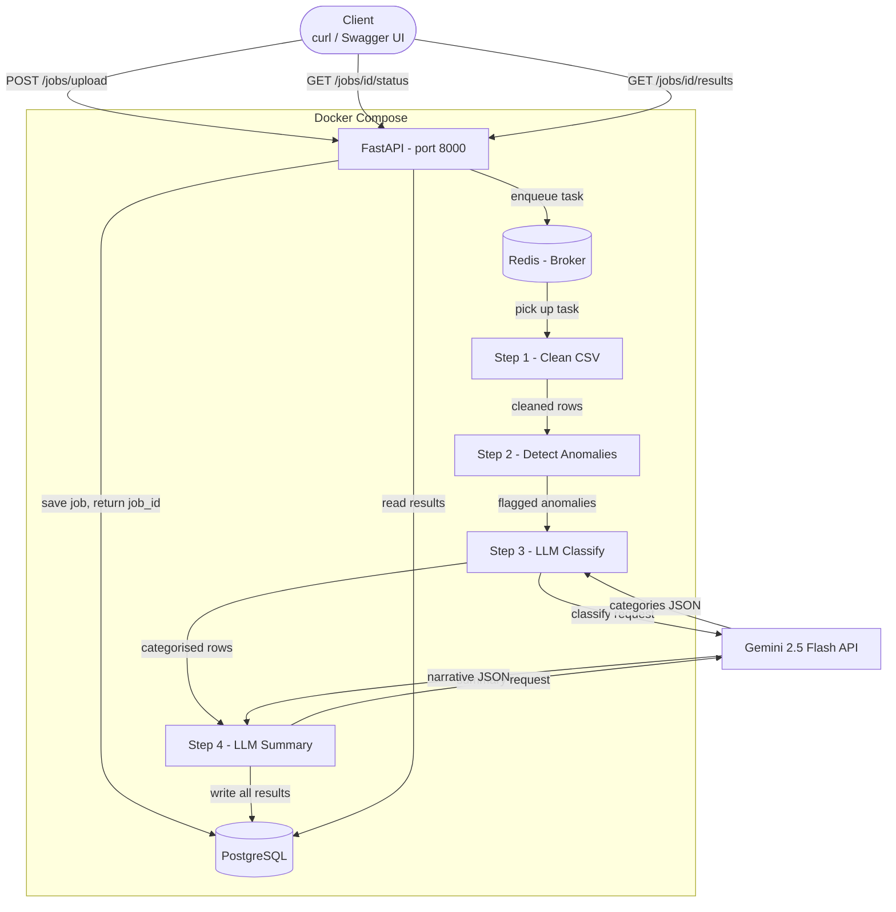

# AI-Powered Transaction Processing Pipeline

A backend system that ingests dirty financial CSV files, processes them asynchronously through a job queue, uses an LLM to classify transactions and detect anomalies, and exposes structured results via a polling REST API.

## Stack

| Layer | Technology |
|---|---|
| API | FastAPI + Uvicorn |
| Database | PostgreSQL 16 |
| Job Queue | Celery + Redis |
| LLM | Google Gemini 2.5 Flash |
| ORM | SQLAlchemy 2 (async) + Alembic |
| Containerisation | Docker + Docker Compose |

## Architecture



## Prerequisites

- [Docker Desktop](https://www.docker.com/products/docker-desktop/) installed and running
- A free [Gemini API Key](https://aistudio.google.com/app/apikey)

## Setup & Run

```bash
# 1. Clone the repository
git clone <your-repo-url>
cd <repo-directory>

# 2. Configure environment
cp .env.example .env
# Edit .env and set your GEMINI_API_KEY

# 3. Start all services (API + Worker + Redis + PostgreSQL)
docker compose up --build
```

The API will be available at **http://localhost:8000**  
Interactive docs (Swagger UI) at **http://localhost:8000/docs**

---

## API Endpoints

### POST /jobs/upload

Upload a CSV file to create a processing job.

```bash
curl -X POST http://localhost:8000/jobs/upload \
  -F "file=@file_path/transactions.csv"
```

**Response (202 Accepted):**
```json
{
  "job_id": "ab6ad37e-f0f8-407c-89be-f8f4267b090a",
  "status": "pending",
  "filename": "transactions.csv",
  "row_count_raw": 95
}
```

---

### GET /jobs/{job_id}/status

Poll for job status. When `completed`, includes a high-level summary.

```bash
curl http://localhost:8000/jobs/ab6ad37e-f0f8-407c-89be-f8f4267b090a/status
```

**Response (processing):**
```json
{
  "job_id": "ab6ad37e-f0f8-407c-89be-f8f4267b090a",
  "status": "processing",
  "filename": "transactions.csv",
  "created_at": "2024-09-01T10:00:00Z",
  "completed_at": null,
  "row_count_raw": 95,
  "row_count_clean": null,
  "summary": null
}
```

**Response (completed):**
```json
{
  "job_id": "ab6ad37e-f0f8-407c-89be-f8f4267b090a",
  "status": "completed",
  "filename": "transactions.csv",
  "created_at": "2026-06-19T11:20:04Z",
  "completed_at": "2026-06-19T11:20:16Z",
  "row_count_raw": 95,
  "row_count_clean": 85,
  "summary": {
    "total_spend_inr": "1339923.00",
    "total_spend_usd": "74185.14",
    "top_merchants": [
      {"merchant": "IRCTC", "total": 450697.69},
      {"merchant": "Jio Recharge", "total": 270255.97},
      {"merchant": "Flipkart", "total": 227539.88}
    ],
    "anomaly_count": 10,
    "narrative": "Total spending amounted to INR 1,339,923.00 and USD 74,185.14, with significant expenditure on travel, utilities, and shopping. A notable concern is the presence of 10 anomalies, including multiple suspicious USD transactions at domestic merchants.",
    "risk_level": "high"
  }
}
```

---

### GET /jobs/{job_id}/results

Full structured output: all cleaned transactions, flagged anomalies, per-category spend, and LLM narrative summary.

```bash
curl http://localhost:8000/jobs/ab6ad37e-f0f8-407c-89be-f8f4267b090a/results
```

**Response:**
```json
{
  "job_id": "ab6ad37e-f0f8-407c-89be-f8f4267b090a",
  "status": "completed",
  "transactions": [
    {
      "id": "0a75edbe-4891-47ee-933b-073a88088e20",
      "txn_id": "TXN1065",
      "date": "2024-09-04",
      "merchant": "Flipkart",
      "amount": "10882.55",
      "currency": "INR",
      "status": "SUCCESS",
      "category": "Shopping",
      "account_id": "ACC003",
      "notes": "Refund expected",
      "is_anomaly": false,
      "anomaly_reason": null,
      "llm_category": null,
      "llm_failed": false
    }
  ],
  "anomalies": [
    {
      "txn_id": "TXN2001",
      "merchant": "IRCTC",
      "amount": "175917.65",
      "currency": "INR",
      "is_anomaly": true,
      "anomaly_reason": "Amount 175917.65 exceeds 3x account median (10897.83)"
    }
  ],
  "category_breakdown": {
    "Food": 110107.31,
    "Travel": 481820.60,
    "Shopping": 280715.73,
    "Transport": 215704.49,
    "Utilities": 270255.97,
    "Entertainment": 24916.49,
    "Cash Withdrawal": 30587.55
  },
  "llm_summary": {
    "total_spend_inr": "1339923.00",
    "total_spend_usd": "74185.14",
    "top_merchants": [
      {"merchant": "IRCTC", "total": 450697.69},
      {"merchant": "Jio Recharge", "total": 270255.97},
      {"merchant": "Flipkart", "total": 227539.88}
    ],
    "anomaly_count": 10,
    "narrative": "Total spending amounted to INR 1,339,923.00 and USD 74,185.14. Top merchants include IRCTC, Jio Recharge, and Flipkart. A notable concern is the presence of 10 anomalies, including multiple suspicious USD transactions at Zomato and several unusually large transactions.",
    "risk_level": "high",
    "category_breakdown": {
      "Food": 110107.31,
      "Travel": 481820.60,
      "Shopping": 280715.73
    }
  }
}
```

---

### GET /jobs

List all jobs with optional status filter.

```bash
# All jobs
curl http://localhost:8000/jobs

# Filter by status
curl "http://localhost:8000/jobs?status=completed"
curl "http://localhost:8000/jobs?status=pending"
curl "http://localhost:8000/jobs?status=failed"
```

**Response:**
```json
[
  {
    "job_id": "ab6ad37e-f0f8-407c-89be-f8f4267b090a",
    "filename": "transactions.csv",
    "status": "completed",
    "row_count_raw": 95,
    "created_at": "2026-06-19T11:25:19Z"
  }
]
```

---

## Processing Pipeline

When a job is dequeued, the Celery worker runs these steps in order:

1. **Data Cleaning** — Normalise date formats (DD-MM-YYYY and YYYY/MM/DD → ISO 8601), strip `$` from amounts, uppercase status and currency, fill blank categories with `Uncategorised`, remove exact duplicate rows.

2. **Anomaly Detection**
   - Flag transactions where `amount > 3× the account's median`
   - Flag USD transactions at domestic-only merchants (Swiggy, Ola, IRCTC, Zomato, BookMyShow, Jio Recharge, HDFC ATM)

3. **LLM Classification** — All uncategorised transactions are batched into a single Gemini API call. Assigns one of: `Food`, `Shopping`, `Travel`, `Transport`, `Utilities`, `Cash Withdrawal`, `Entertainment`, or `Other`.

4. **LLM Narrative Summary** — A single Gemini call generates total spend by currency, top 3 merchants by spend, anomaly count, a 2-3 sentence narrative, and a risk level (`low` / `medium` / `high`).

5. **Retry Logic** — LLM calls retry up to 3 times with exponential backoff (1s → 2s → 4s). If all retries fail, the batch is marked `llm_failed` and processing continues without halting the job.

---

## Project Structure

```
app/
├── main.py              # FastAPI entry point
├── config.py            # Settings (reads from .env)
├── database.py          # Async SQLAlchemy engine
├── models/              # ORM models (Job, Transaction, JobSummary)
├── schemas/             # Pydantic response schemas
├── routers/             # API route handlers
├── services/            # Business logic (cleaner, anomaly, llm, csv_parser)
└── worker/              # Celery app + tasks
alembic/                 # Database migrations
tests/                   # Test suite
docs/                    # System design & architecture notes
Dockerfile
docker-compose.yml
```

---

## Running Tests

```bash
# Run all tests
pytest tests/ -v

# Run specific files
pytest tests/test_cleaner.py -v
pytest tests/test_anomaly.py -v
```

---

## Known Data Quirks in transactions.csv

- **~10 duplicate rows** — removed during cleaning (95 raw → 85 clean)
- **Mixed date formats** — both `DD-MM-YYYY` and `YYYY/MM/DD` normalised to ISO 8601
- **`$` prefix on amounts** — stripped before parsing to `Decimal`
- **Lowercase currency values** — `inr` normalised to `INR`
- **Blank `txn_id` rows** — kept as valid transactions with `txn_id: null`
- **Statistical outliers** — several large INR transactions (100k–190k) flagged per account median rule
- **USD at domestic merchants** — Zomato, IRCTC USD transactions flagged as currency mismatches
